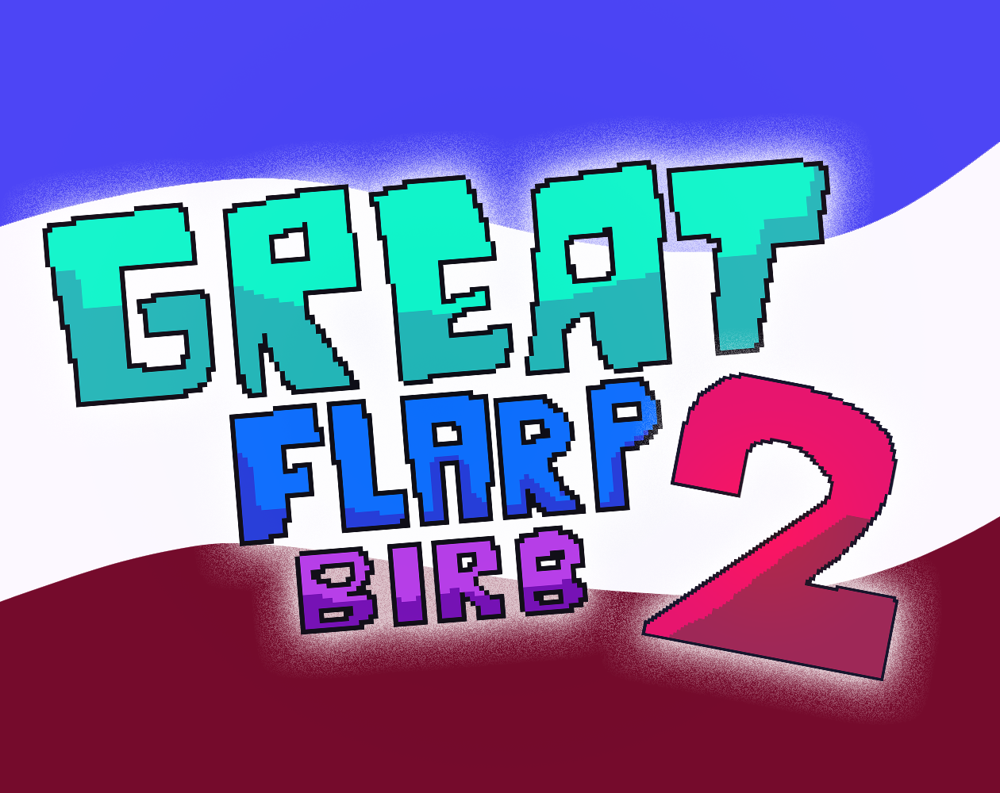
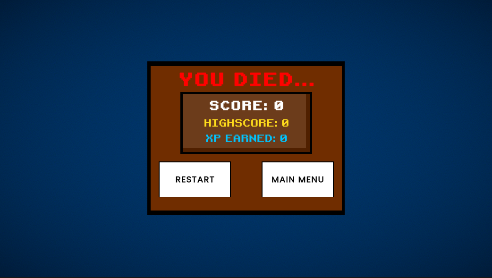
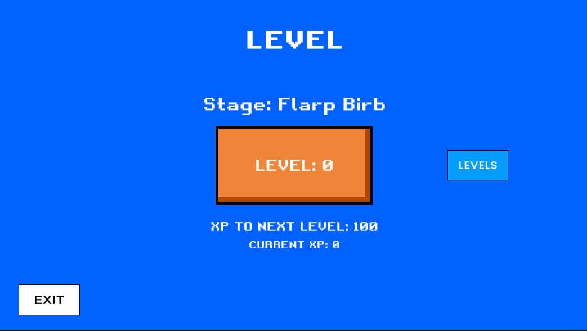
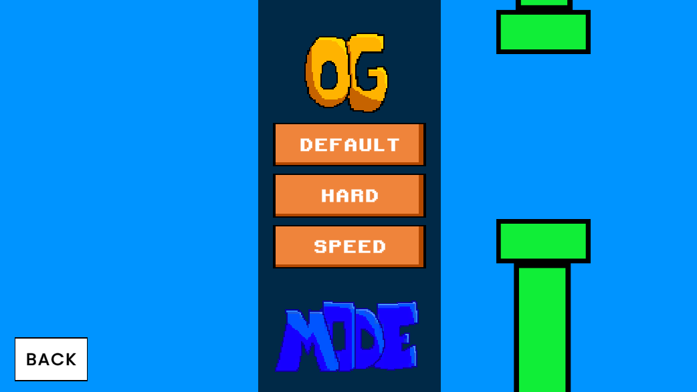
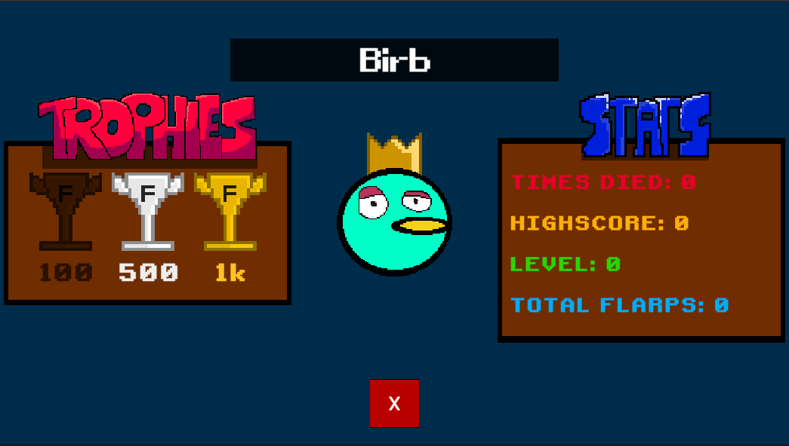
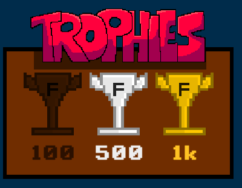

# Great Flarp Birb 2

Originally supposed to be a barebones sequel containing some scrapped ideas, it quickly turned into an absolute overhaul of the original which includes options, custom flarp colors, highscores, trophies and more.

  
Documentation:
Coming soon

# Features

> Highscores

Highscores, completely managed within the game!

> XP System

XP System with levels

> Gamemodes

Multiple gamemodes to enhance gameplay which change rewards

> Stats

All time flarps, deaths, and highscore

> Customisable Character

Customisable character with either different presets or custom HSV color values, as well as clothing

> Snazzy Animations

Animations made with ASESPRITE and the Unity Animation Editor

> Secrets

Lots, of secrets
